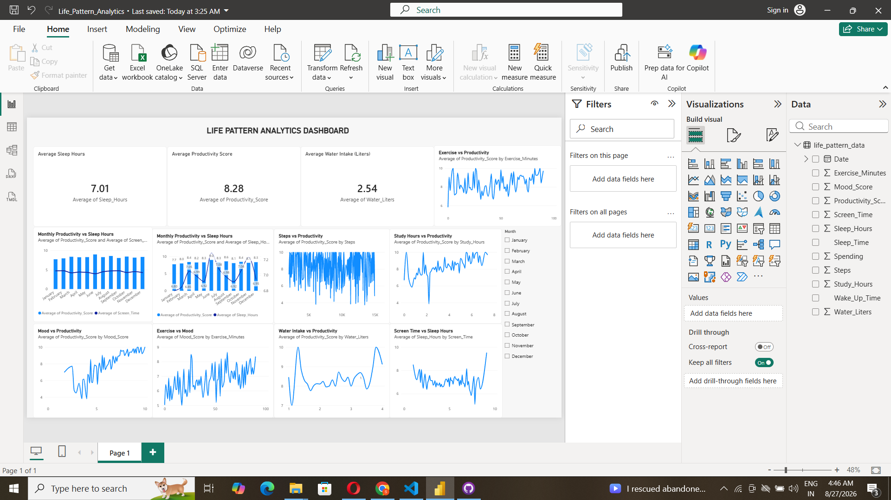

# Life Pattern Analytics 📊
## 📊 Dashboard Preview



A data analytics project that explores the relationship between daily lifestyle habits, mood, and productivity using Python and Power BI.

## 📌 Project Overview

This project analyzes a simulated lifestyle dataset containing daily information about:

- Sleep Hours
- Screen Time
- Study Hours
- Exercise Minutes
- Mood Score
- Productivity Score
- Water Intake
- Daily Steps

The goal is to identify patterns between lifestyle habits, mood, and productivity.

## 🛠️ Tools & Technologies

- Python
- Pandas
- NumPy
- Matplotlib
- Power BI
- CSV

## 📊 Analysis Performed

- Sleep vs Productivity
- Screen Time vs Productivity
- Exercise vs Mood
- Exercise vs Productivity
- Mood vs Productivity
- Study Hours vs Productivity
- Steps vs Productivity
- Water Intake vs Productivity
- Monthly Productivity Analysis

## 📈 Key Insights

- Average Productivity Score: **8.28**
- Average Sleep: **7.01 hours**
- Average Water Intake: **2.54 liters**
- Highest monthly productivity: **June — 8.97**
- Lowest monthly productivity: **January — 7.72**

### Correlation Analysis

- Sleep → Productivity: **+0.546**
- Screen Time → Productivity: **−0.425**
- Exercise → Mood: **+0.355**

## 📊 Dashboard

The Power BI dashboard provides interactive analysis using:

- KPI Cards
- Monthly trends
- Lifestyle comparisons
- Month slicer/filter

## ⚠️ Dataset Note

This project uses a **simulated dataset created for learning and portfolio purposes**. The findings should not be interpreted as real-world scientific or medical conclusions.

## 🚀 Project Structure

```text
Life-pattern-analytics/
│
├── generate_dataset.py
├── life_pattern_data.csv
├── Life_Pattern_Analytics.pbix
└── README.md
## 🚀 Key Insights

- 😴 **Sleep & Productivity:** Higher sleep duration is associated with higher productivity.
- 📱 **Screen Time & Productivity:** Higher screen time is associated with lower productivity.
- 🏃 **Exercise & Mood:** More exercise is associated with better mood.
- 📚 **Study Hours & Productivity:** Study hours show a positive relationship with productivity.
- 💧 **Water Intake:** Water intake shows a moderate relationship with productivity.

### Correlation Highlights

| Factor | Correlation |
|---|---:|
| Sleep → Productivity | 0.546 |
| Screen Time → Productivity | -0.425 |
| Exercise → Mood | 0.354 |
## 🛠️ Tools & Technologies

- Python
- Pandas
- NumPy
- Matplotlib
- Power BI
- CSV Dataset
- Git & GitHub
## 📁 Project Structure

```text
life-pattern-analytics/
├── generate_dataset.py
├── life_pattern_data.csv
├── Life_Pattern_Analytics.pbix
├── dashboard.png
└── README.md
### 🚀 How to Run
```text

### 1. Clone the Repository

```bash
git clone https://github.com/Sonukumar07112002/life-pattern-analytics.git
cd life-pattern-analytics
```

### 2. Install Python Libraries

```bash
pip install pandas numpy matplotlib
```

### 3. Generate the Dataset

```bash
python generate_dataset.py
```

### 4. Open the Power BI Dashboard

Open `Life_Pattern_Analytics.pbix` using Microsoft Power BI Desktop.

The dashboard contains KPI cards, lifestyle analysis charts, monthly productivity trends, and an interactive month slicer.
